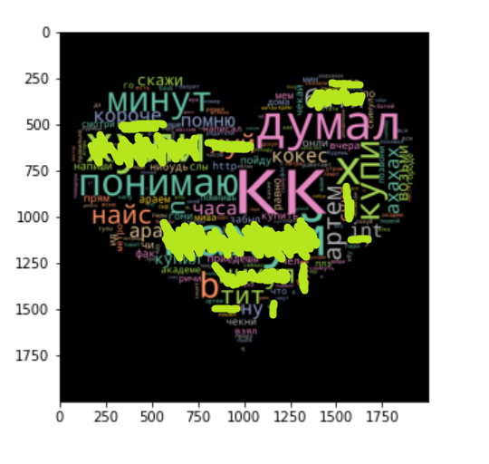

# Wordcloud с кастомной маской из telegram сообщений

Как-то на хабре я увидел [классную статью](https://habr.com/ru/articles/580560/) про то, как можно красивую картиночку из слов сделать. 

Что-то вроде вот такого

Там всё это делали в Вконтакте, я же сделал то же с телегой.

## Как использовать

В чате телеге жмём на три точки и тыкаем на экспорт диалогов. Нам нужны только текстовые сообщения, поэтому галочки не тыкаем.
Экспортируем в JSON, это важно!  
Переименовываем его в data.json, кидаем в папку этой репы ну и запускаем ноутбук и пошло поехало

По умолчанию, телеграм при экспорте выдаёт вот такого вида JSON

`
{ "name": "ИМЯ_СОБЕСЕДНИКА",  
"type": "personal_chat",
 "id": ИД_ЧАТА,  
 "messages": [{  
   "id": ИД_СООБЩЕНИЯ,  
   "type": "message",
   "date": "YYYY-MM-DDThh:mm:ss",
   "date_unixtime": "123456789",
   "from": "ИМЯ_ОТПРАВИТЕЛЯ",
   "from_id": "ИД_ОТПРАВИТЕЛЯ",
   "text": "я текст этого сообщения",
   "text_entities": [
    {
     "type": "plain",
     "text": "я текст этого сообщения"
    }],
 }, ] }
`

Нас интересует только часть с `messages[i]['text']`. Собственно, её и загоняем в датафрейм, ну и дальше по тетрадке